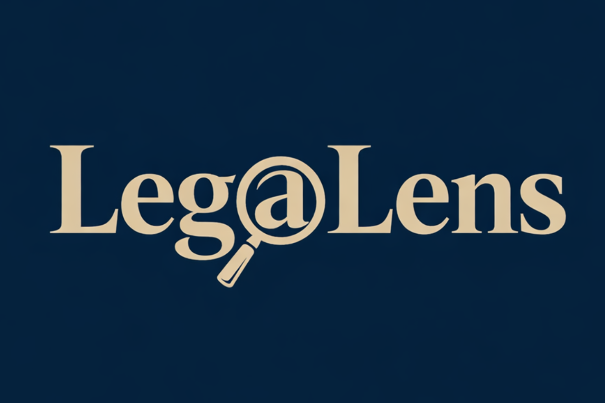
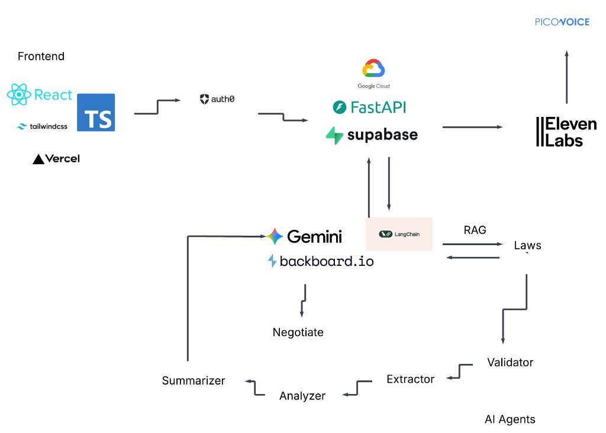

<p align="center">
  
</p>

<h1 align="center">LegaLens</h1>

LegaLens is an AI-powered legal document assistant. Upload contracts (PDF or DOCX), get clause-level analysis against Canadian law, negotiation strategies, and a voice consultant—all backed by Gemini, LangChain, and a RAG pipeline over a legal knowledge base.

## Tech stack



| Layer | Technology |
|-------|------------|
| **Frontend** | React, TypeScript, Tailwind CSS, Vite; deployed on **Vercel** |
| **Auth** | **Auth0** |
| **Backend** | **FastAPI** on **Google Cloud** (Cloud Run) |
| **Database** | **Supabase** |
| **Voice** | **ElevenLabs**, **Picovoice** |
| **AI Agents** | **Gemini**, **Backboardio**, **LangChain**, **RAG** |

## Features

- **Document upload & analysis** — Upload PDF or DOCX; pipeline validates document type, extracts legal clauses, scores them against Canadian law, and produces an executive summary, top risks, and bottom line.
- **Negotiation** — Per-clause negotiation strategies (rewritten text, script, priority, leverage, fallback) for high-severity clauses, with caching in Redis/Supabase.
- **Q&A** — Ask questions about the document; answers are grounded in the uploaded text via RAG and logged in Backboard.
- **Voice consultant** — ElevenLabs voice sessions with wake-word (Picovoice); turn-by-turn conversation backed by the same document Q&A and Backboard.
- **Document management** — Supabase storage and metadata; list, view, re-analyze, and delete documents. Analysis and negotiated clauses are persisted and reused when available.

## Project structure

```
legalens/
├── frontend/          # React + Vite app (Auth0, ElevenLabs, Vercel)
├── backend/           # FastAPI app (agents, voice, db, auth)
│   ├── app/
│   │   ├── main.py
│   │   ├── router.py
│   │   ├── agents/    # Validator, Extractor, Analyst, Summarizer, Negotiate, Backboard
│   │   ├── auth/      # Auth0 JWT validation, /auth/me
│   │   ├── db/        # Supabase storage, analyses, negotiated clauses, Redis cache
│   │   ├── services/  # PDF parsing
│   │   └── voice/     # TTS, sessions, turn-by-turn (ElevenLabs + QA)
│   ├── requirements.txt
│   ├── Dockerfile
│   ├── cloudbuild.yaml
│   └── DEPLOY_GCP.md
├── docs/
│   └── tech-stack.png
└── README.md
```

## Quick start

### Backend

1. **Python 3.11+** and a virtualenv recommended.

2. **Copy env and configure:**
   ```bash
   cd backend
   cp .env-example .env
   # Edit .env: Supabase, Auth0, Gemini, Backboard, ElevenLabs, Picovoice, Redis, CORS, etc.
   ```

3. **Install and run:**
   ```bash
   pip install -r requirements.txt
   uvicorn app.main:app --reload
   ```
   API: `http://localhost:8000`; docs: `http://localhost:8000/docs`.

### Frontend

1. **Copy env and configure:**
   ```bash
   cd frontend
   cp .env-example .env
   # Set VITE_AUTH0_DOMAIN, VITE_AUTH0_CLIENT_ID, VITE_AUTH0_AUDIENCE, VITE_API_URL (optional for local proxy)
   ```

2. **Install and run:**
   ```bash
   npm install
   npm run dev
   ```
   App: `http://localhost:5173`. With default Vite proxy, `/api` goes to the backend.